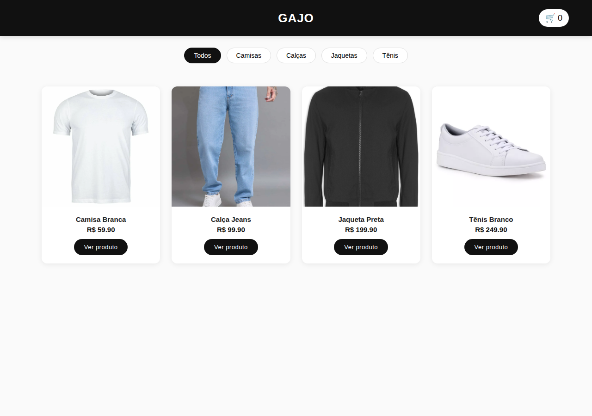
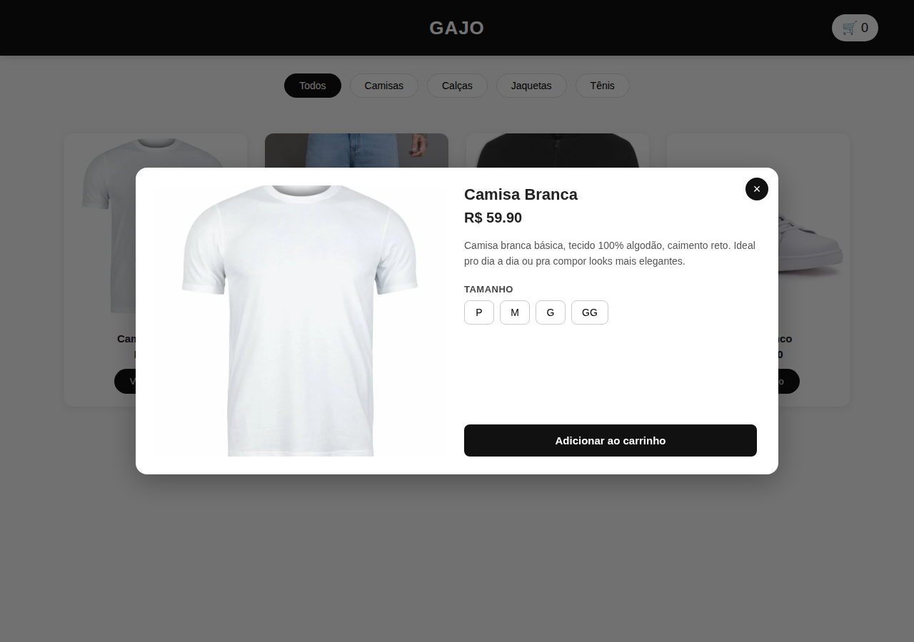

# GAJO — Loja Virtual

E-commerce estático feito em **HTML, CSS e JavaScript puro** (sem frameworks nem bibliotecas), hospedado gratuitamente no GitHub Pages.

🔗 **Demo ao vivo:** [znunesz.github.io/loja-gajo](https://znunesz.github.io/loja-gajo/)



## Funcionalidades

- **Catálogo de produtos** filtrável por categoria (camisas, calças, jaquetas, tênis)
- **Modal de detalhes do produto** com galeria de imagens, descrição e seleção de tamanho
- **Carrinho de compras** com atualização de total e contador em tempo real
- **Checkout via WhatsApp** — monta e envia automaticamente uma mensagem formatada com os itens e o total
- **Catálogo desacoplado da lógica**: adicionar um produto, foto ou tamanho novo não exige tocar em HTML, CSS ou JS



## Stack

- **HTML5** — estrutura semântica da página
- **CSS3** — layout responsivo, sem framework de UI
- **JavaScript (vanilla)** — manipulação de DOM, filtros, carrinho e lógica do modal, sem libs externas
- **GitHub Pages** — hospedagem estática

## Arquitetura

O projeto separa **dados** de **lógica de renderização**:

```
├── index.html      # estrutura da página e do modal
├── style.css       # todo o visual do site
├── script.js       # lógica: renderização, carrinho, filtros, modal
├── produtos.js      # dados dos produtos (única fonte de verdade do catálogo)
└── img/
    ├── camisa/
    ├── calca/
    ├── jaqueta/
    └── tenis/
```

Cada produto em `produtos.js` segue esta estrutura:

```js
{
    id: 1,
    nome: "Camisa Branca",
    preco: 59.90,
    categoria: "camisa",
    descricao: "Camisa branca básica, tecido 100% algodão...",
    tamanhos: ["P", "M", "G", "GG"],
    imagens: ["img/camisa/1.webp"]
}
```

Essa separação permite atualizar o catálogo (produto, foto, tamanho, preço) editando um único arquivo de dados, sem risco de quebrar a estrutura, o estilo ou a lógica do site.

## Rodando localmente

Como é um site 100% estático, basta abrir o `index.html` no navegador — não precisa de servidor, build ou instalação de dependências.

## Autor

Desenvolvido por [znunesz](https://github.com/znunesz).
